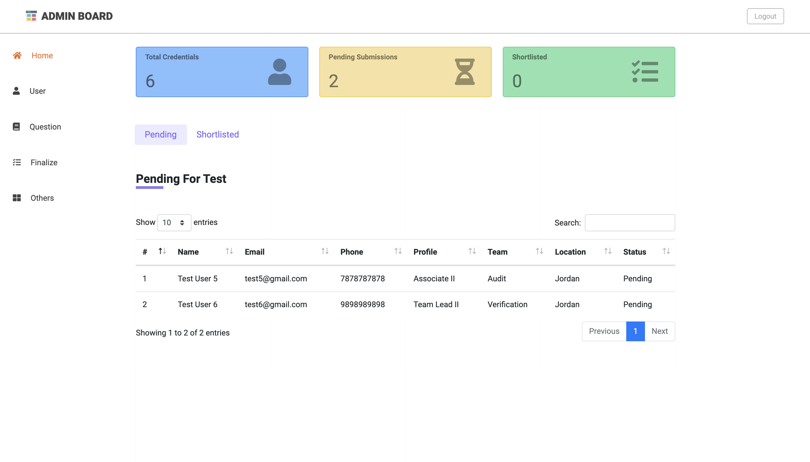
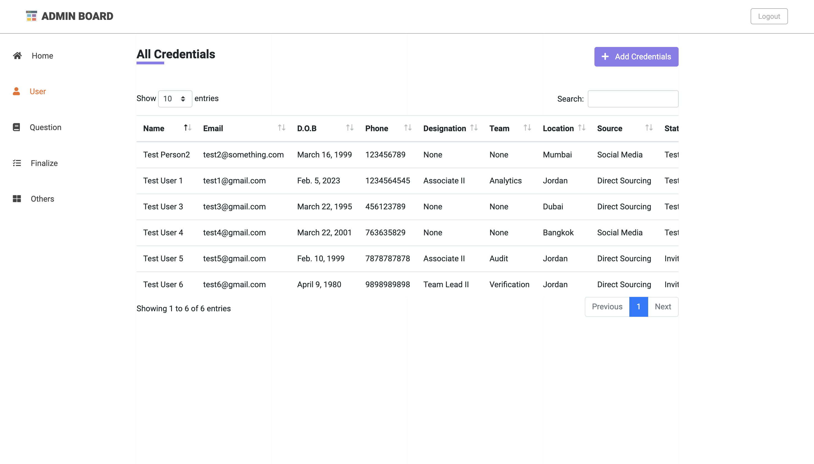
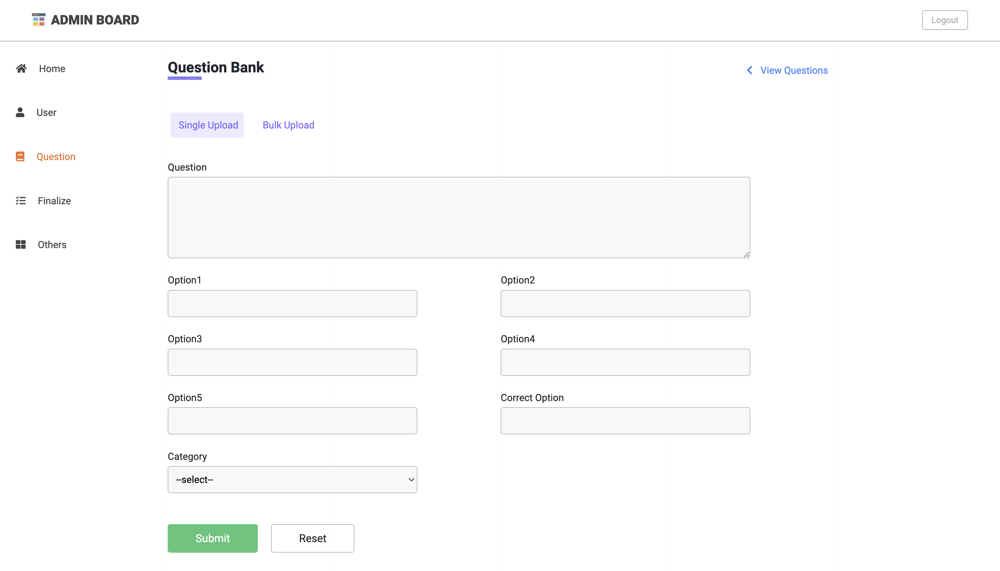
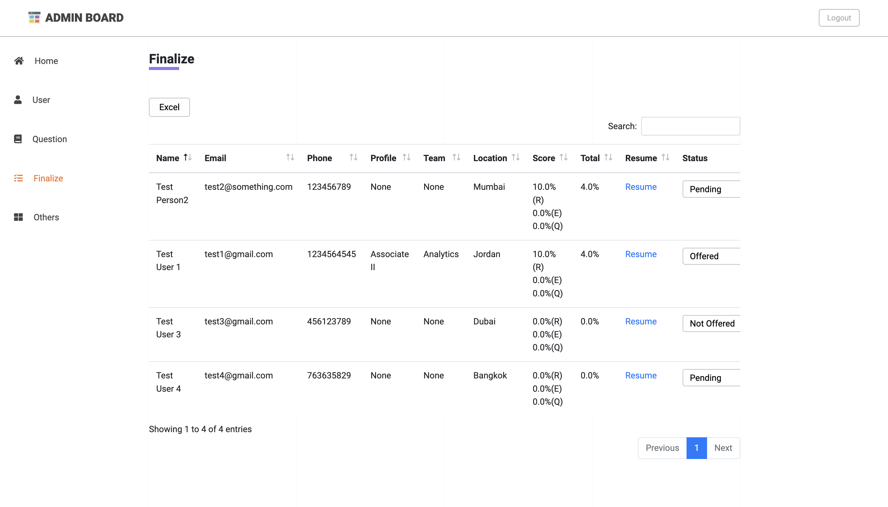
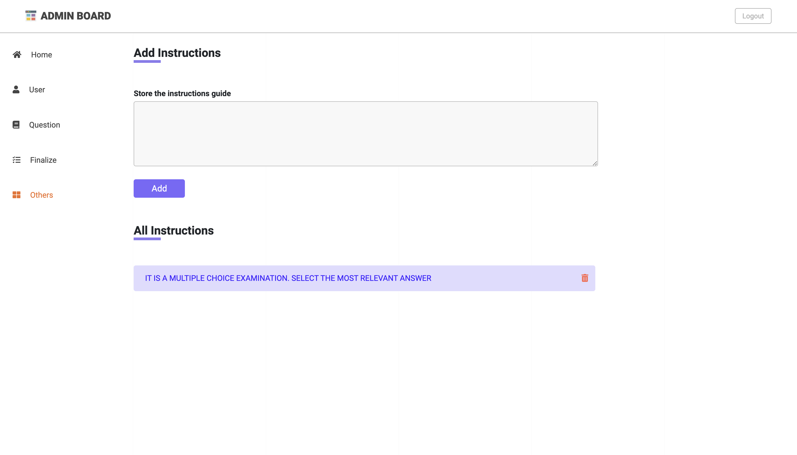

# Aptitude Analyzer System
Aptitude Analyzer System is an online examination system that has many new and enhanced features compared to the existing online examination systems.
The main idea behind taking this project is to implement an aptitude analyzer where the administrator will upload aptitude questions and answers and 
the user of the examination system, test takers will be able to answer the questions of the aptitude. 
The dashboard shows the marks allocated to the user attempting the aptitude test and the analysis of the performance of the users in the test.

## Table of Contents

* [Audience](#audience)
* [Contents - Features](#contents-features)
* [Requirements](#Requirements)
* [Technology Stack used in App](#technology-stack-used-in-app)
* [Building Aptitude Analyzer System](#Aptitude-Analyzer-System)
* [Application screenshots and steps to use the app](#application-screenshots-and-steps-to-use-the-app)
* [Contributors](#Contributors)

## Audience
The audience for this project would be organizations or individuals who want to assess the aptitude skills of potential employees or candidates. This project can also be useful for educational institutions to test their students' aptitude skills. The audience could also be developers who want to learn about building a web-based aptitude analyzer system or want to use this project as a reference for building similar systems.

##  👨‍💻 Contents - Features
- Admin login/registration  
- Home page with a dashboard displaying user information and pending submissions  
- User page to manage candidate credentials with add and edit options 
- Question page with single and bulk upload options and the ability to view and edit uploaded questions  
- Finalize page with candidate information, status change options, and the ability to download data in excel format  
- Others page to add instructions for users before taking the quiz  
- Aptitude test quiz with multiple categories including English, Reasoning, and Quantitative  
- Randomized questions for each candidate  
- Timed quiz with a set time limit  
- Results displayed to candidate at the end of the quiz  
- Score calculation and percentage displayed to the candidate  
- Admin dashboard with an overview of all user and test data  
- Admin ability to export test data to excel format  
- Admin ability to change the status of a candidate in the Finalize page  
- Admin ability to download user resumes  
- Admin ability to delete user information and test data  
- Responsive design for mobile and desktop devices  

## 📋 Requirements
- Login Logout functionality
- User Registration
- Admin role upload aptitude tests 
- Admin can bulk upload questions
- Questions Category
- User role attempt examination
- Generate reports on user performance
- User Dashboard 
- Details of Shortlisted candidates
- Email notification

✍️ **Technical requirements:**
- Exception Handling
- Logging
- Dynamic database backup
- Project Deployment on AWS

## 💻 Technology Stack used in App
- Python
- Libraries of python 
- SQLite
- Django framework
- PostgreSQL
- HTML
- CSS 
- Ajax
- AWS
- Jenkins

## Building Aptitude Analyzer System
Building an aptitude analyzer system involves developing a computer-based platform that can evaluate and measure an individual's cognitive abilities, such as critical thinking, logical reasoning, problem-solving, and mathematical skills. The system should have an extensive question bank with a variety of questions from different domains like verbal, numerical, and abstract reasoning. The system should provide candidates with a fair and standardized test, ensuring that every individual is given an equal opportunity to showcase their skills.

The aptitude analyzer system should provide users with real-time feedback, with an accurate evaluation of their abilities. It should also provide detailed analytics and reports for the admin, highlighting individual and overall performance, including areas where candidates may need further improvement.

## Application screenshots and steps to use the app
Home:
The Home page of the admin board is the first page that opens up when the admin logs into the system. It provides a comprehensive view of the admin dashboard, user information, and navigation bar. The navigation bar on the left side of the page includes different options, such as Home, User, Question, Finalize, and Others. This navigation bar provides easy access to all the functionalities of the system. The user information section on the Home page displays the credentials of the candidates who have registered but are yet to give the aptitude test. The credentials include full name, username, email, phone number, date of birth, designation, team, location, source, and resume upload. This information allows the admin to keep track of the candidates who are in the pipeline for taking the test.

The dashboard on top of the Home page displays various important statistics related to the aptitude test. It provides an overview of the total credentials of the users who have attempted the test, pending submissions of candidates who still need to give the test, and the number of shortlisted candidates. This dashboard helps the admin to monitor the progress of the aptitude test and the performance of the candidates. The Home page also provides easy access to other functionalities, such as creating new questions for the test, finalizing the results of the test, and managing other important settings. In summary, the Home page provides an overview of the system's functionalities and enables the admin to manage and monitor the aptitude test effectively.

User:
The user page in the admin board is a vital component of the entire system. It displays a table of all the credentials of candidates who attempted the test. The information is arranged in a structured and user-friendly manner with the categories being Name, Email, dob, Phone, Designation, Team, Location, Source, Status, and Action. The Action category is particularly useful as it provides an option to edit the information in case of any errors or changes required. This feature is an excellent addition to the page as it saves a lot of time and effort for the admin, who does not have to go through each profile individually to make the required changes.

Additionally, the top right corner of the page has an add credentials button, which allows the admin to create a profile for a new candidate. This feature comes in handy when the admin receives new candidates to add to the system. It streamlines the entire process, and the admin can add the credentials quickly without going through multiple pages or forms. Overall, the user page is a well-designed and efficient feature that provides all the necessary information about candidates at a glance and allows the admin to make necessary changes and additions without any hassle.

Question:
The question page is an essential part of the admin board, which allows the admin to upload questions for the aptitude test. The page includes two sections, single upload and bulk upload, providing flexibility to the admin to upload questions based on their preference. In the single upload section, the admin can enter the question, options, correct option, and category, which helps to categorize the questions as English, Reasoning, or Quantitative. The bulk upload option allows the admin to upload a file that contains multiple questions at once, making it a more time-efficient option for uploading a large number of questions. With these options, the admin can quickly and easily manage the question bank for the aptitude test.

The view questions button, located on the top right side of the page, enables the admin to see all the uploaded questions in a tabular format. The table displays the question, options, correct option, and category. This table makes it easier for the admin to view and manage the uploaded questions. In addition, the table also has an edit button in the action column, which enables the admin to make changes to the questions if required. This feature adds to the flexibility of the question page, allowing the admin to maintain the question bank efficiently. 

Finalize:
The Finalize page is a critical component of the admin board, which provides a comprehensive overview of the candidate's performance and other essential details. The page contains the name, email, phone, team, and location of the candidates who have taken the aptitude test. In addition, it shows the score obtained by the candidates in the test, the total percentage scored, and the candidate's resume. A status tab is also present, which allows the admin to change the status of the candidate to pending, offered, not offered, joined, or not joined, based on their resume and percentage scored.

The download button on the top left side of the page is a useful feature, which allows the admin to download all the information in an excel format. This information can be used to create reports, track the candidate's progress, and help the admin make better decisions. The Finalize page provides a powerful tool for the admin to manage the recruitment process efficiently, and the excel download feature makes it easier to process and analyze the data.

Others
The Others page provides a space for the admin to add instructions that will be displayed to the user before they start their aptitude test. This is an important feature as it can help the user understand the expectations of the test, the format of the questions, and any other specific details that might be relevant. The instructions can be added and edited at any time by the admin, giving them the flexibility to update the information as needed. By providing clear and concise instructions, the user can have a better understanding of the test, and this can help them perform better and feel more confident while attempting the quiz.

 
## Contributors
### Raghav Sharma 
### Neha Garg 
### Chiranjeev Trivedi 
